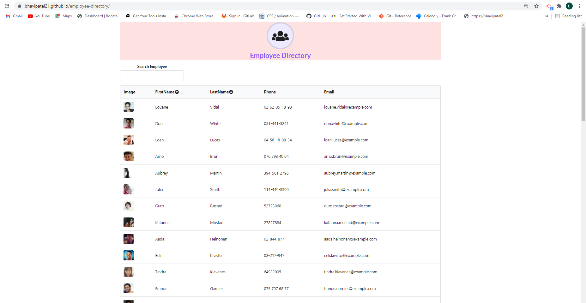

## Project Title

#  Employee Directory

## Description
Create an employee directory app using React components.

## User Story

* As a user, I want to be able to view my entire employee directory at once so that I have quick access to their information.

## Business Context

An employee or manager would benefit greatly from being able to view non-sensitive data about other employees. It would be particularly helpful to be able to filter employees by name.

## Helpful Links
* [React.js](https://reactjs.org/)
* [Semantic-UI](https://react.semantic-ui.com/usage/)
* [Tailwindcss](https://tailwindcss.com/)
* Deploy this site to GitHub Pages using the [Create React App docs for deployment.](https://create-react-app.dev/docs/deployment/#github-pages)

## Web Url :

Navigate to : https://bhavipatel21.github.io/employee-directory/

## Mock-up 

## Contribution Guidelines
Link to Contributor's Covenant: https://www.contributor-covenant.org/version/2/0/code_of_conduct/

## License

*This project uses the [MIT](https://spdx.org/licenses/MIT.html) license.*

## Questions
Github Profile : [Creator]:(https://github.com/bhavipatel21)

If you have any questions please email me at bhavij0511@gmail.com